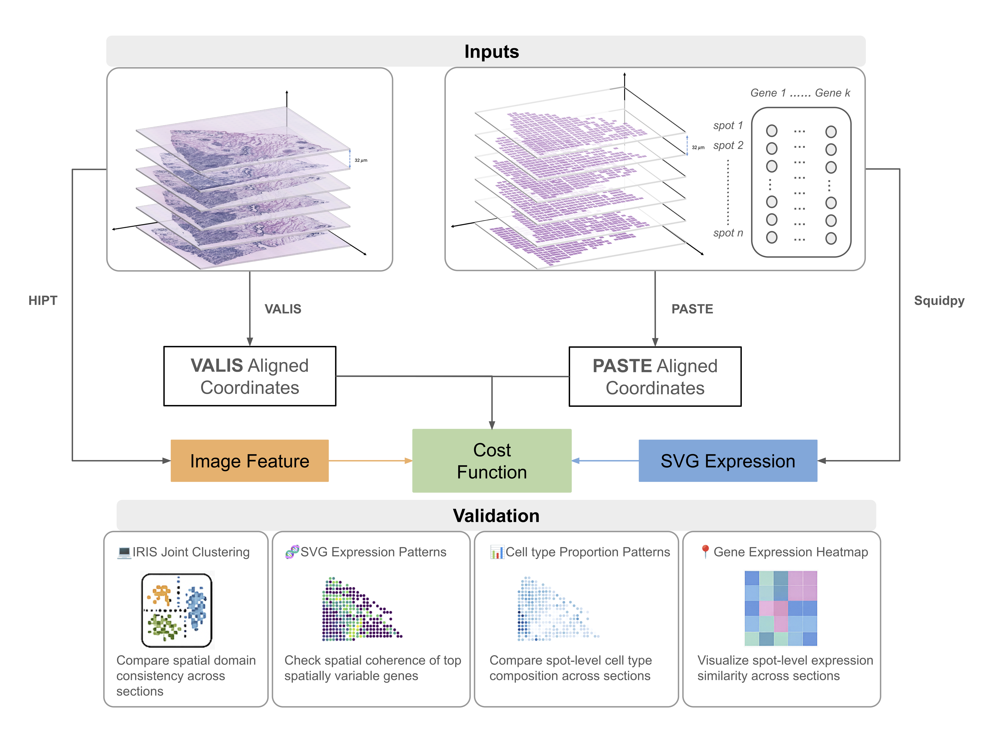

# Thesis Project: Systematic Evaluation of Spatial Transcriptomics Alignment Methods 

- This repository accompanies the thesis **“Systematic Evaluation of Spatial Transcriptomics Alignment Methods.”**  
- It provides example data, evaluation code, and a tutorial demonstrating how different alignment strategies perform when integrating spatial transcriptomics sections.

---

## Overview

This project evaluates spatial alignment methods that integrate transcriptomic and image-based features from consecutive tissue sections.  
The comparison framework supports quantitative and visual assessment of alignment accuracy based on spot-level coordinate transformations.


**Figure 1:** Workflow of the thesis project
---

## Repository Structure

```text
project-root/
│
├── code/
│ └── eval_main.py
│
├── sample_data/
│ ├── spatial_coords/
│ │ ├── B1_to_B2_ref_gene_expression_based_coords.csv
│ │ ├── B1_to_B2_ref_image_features_based_coords.csv
│ │ ├── B1_to_B2_qry_gene_expression_based_coords.csv
│ │ └── B1_to_B2_qry_image_features_based_coords.csv
│ │
│ └── features/
│ ├── B1_to_B2_ref_gene_expression.csv
│ ├── B1_to_B2_ref_image_features.csv
│ ├── B1_to_B2_qry_gene_expression.csv
│ └── B1_to_B2_qry_image_features.csv
│
├── .gitignore
├── README.md
├── requirements.txt
└── tutorial.ipynb

```

---

## Quick Start

Tested on Python 3.12 with the following packages:

```text
numpy>=1.26
pandas>=2.1
scipy>=1.11
scikit-learn>=1.3
scanpy>=1.9
squidpy>=1.5
```

### 1. Clone the repository
```bash
git clone https://github.com/Ellasx7/ST-alignment-eval.git
cd ST-alignment-eval
```
### 2. Try the tutorial
Open the Jupyter notebook to walk through the evaluation example:
```bash
jupyter lab tutorial.ipynb
```
